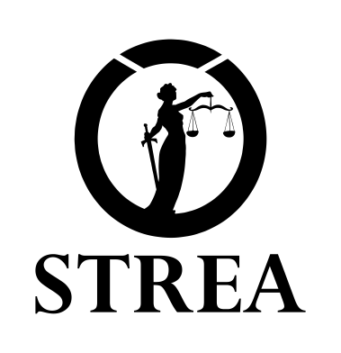

# Strea

Trusted emission reporting for supply chains

## Introduction

Strea stores in a blockchain structure the carbon emissions of a group of companies and their supply chain, as well as providing a series of economic incentives nudging companies towards transparency and accountability.

 

Each Company in the supply chain produces Emission Reports on their carbon emissions, which are stored in the blockchain. Companies are free to disclose any data they choose to and in any format.

When storing an Emission Report in Strea, the company will also assign itself an 

Emissions Rating

 that takes in consideration their carbon neutrality or not, as well as their emissions in comparison with the industry average.